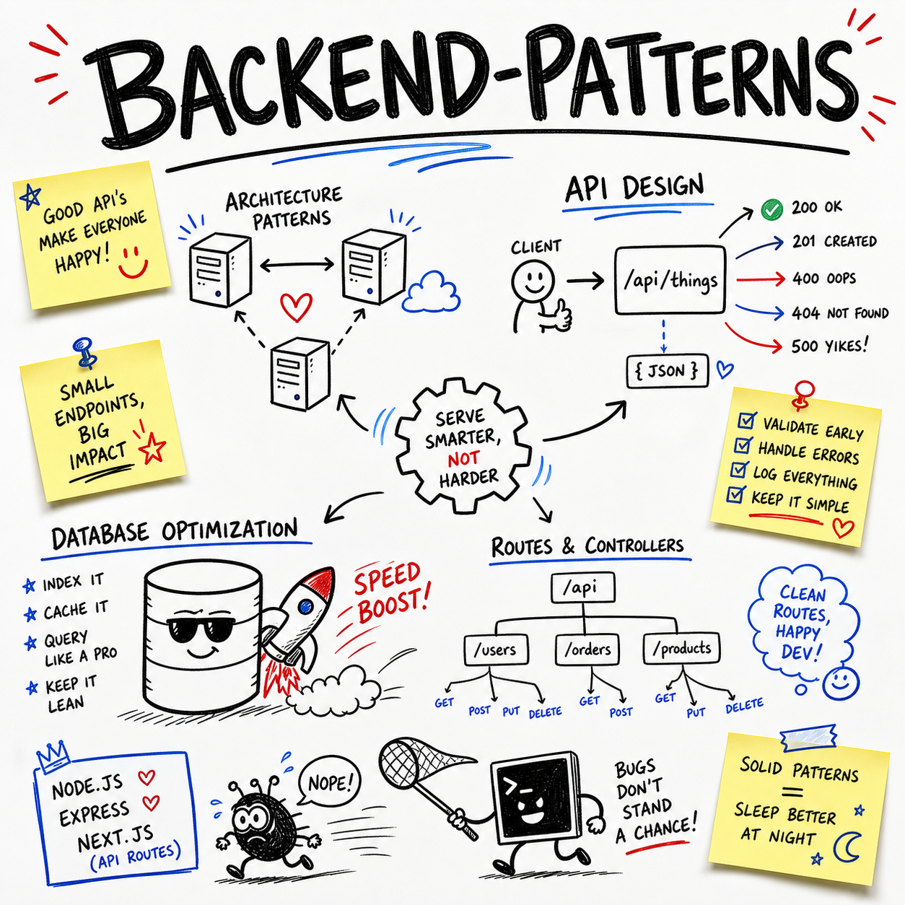

# claude-skill-backend-patterns-plus



   

> **Built on [affaan-m/ECC](https://github.com/affaan-m/ECC)** by @affaan-m (236,595 stars, MIT). All credit for the original idea to them. This fork improves and repackages it; upstream license preserved in [UPSTREAM_LICENSE](UPSTREAM_LICENSE).

**A single-file Claude Code skill for designing secure, reliable, and maintainable Node.js, Express, and Next.js backends.**

Built for developers who want Claude Code to follow practical backend patterns while preserving their project's framework, conventions, and dependencies.

## 💡 Why

Backend changes often cross API, authorization, database, and failure boundaries.

Small mistakes can create inconsistent errors, unsafe writes, slow queries, or retry bugs.

This skill gives Claude Code a composable workflow for reviewing and implementing backend changes. It covers trust boundaries, validation, authorization, atomicity, testing, pagination, observability, and performance without forcing unnecessary architecture.

## ⚡ Install

```bash
mkdir -p ~/.claude/skills/backend-patterns-plus && curl -fsSL https://raw.githubusercontent.com/claude-skill-backend-patterns-plus/claude-skill-backend-patterns-plus/main/skill/SKILL.md -o ~/.claude/skills/backend-patterns-plus/SKILL.md
```

Zero dependencies. One skill file. It plugs into your existing Claude Code workflow.

## 🛠️ Usage

Ask Claude Code to apply the skill to a concrete backend task:

```text
Review my POST /api/markets route using backend-patterns.
Check validation, authorization, transaction safety, idempotency,
error responses, tests, query behavior, and sensitive logging.
Preserve the current framework and dependencies.
```

Expected output:

```text
1. Existing route and data-flow findings
2. Trust boundaries and failure modes
3. Validation and authorization issues
4. Minimal implementation changes
5. Focused tests for success, invalid input, denied access,
   conflicts, retries, and dependency failures
6. Query, pagination, cache, and logging checks
```

The skill follows eight rules:

1. Inspect the existing system before changing it.
2. Identify invariants, trust boundaries, load, and failure modes.
3. Choose the smallest justified architecture.
4. Validate untrusted input at the boundary.
5. Authorize inside the request path.
6. Make related writes atomic and retry-safe.
7. Test success and important failure paths.
8. Check queries, pagination, caching, and sensitive logs.

## 🔄 What we changed vs upstream

- Expanded activation guidance to include security, reliability, observability, and backend code review.
- Added an eight-step workflow covering discovery, trust boundaries, validation, authorization, atomic writes, testing, and performance checks.
- Replaced basic REST examples with detailed guidance on status codes, error envelopes, pagination, stable sorting, idempotency, and versioning.
- Clarified handler, service, repository, and job responsibilities while discouraging unnecessary layers, dependencies, and infrastructure.
- Added explicit GraphQL batching guidance and strengthened repository contracts with structured list inputs and nullable updates.

## 📄 License

Released under the [MIT License](LICENSE). The upstream MIT license and attribution are preserved in [UPSTREAM_LICENSE](UPSTREAM_LICENSE).